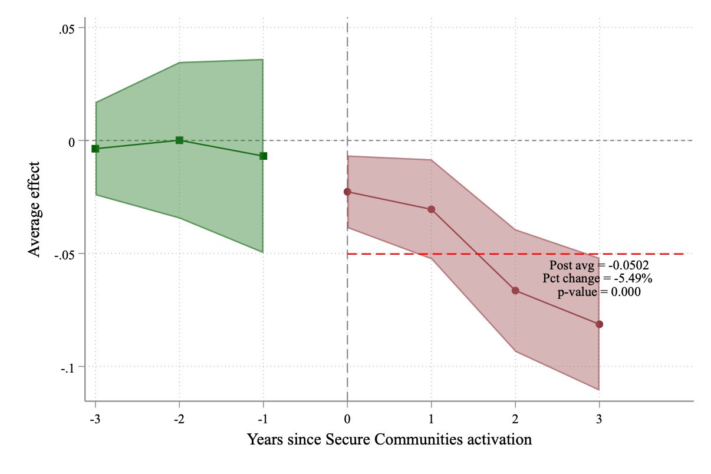
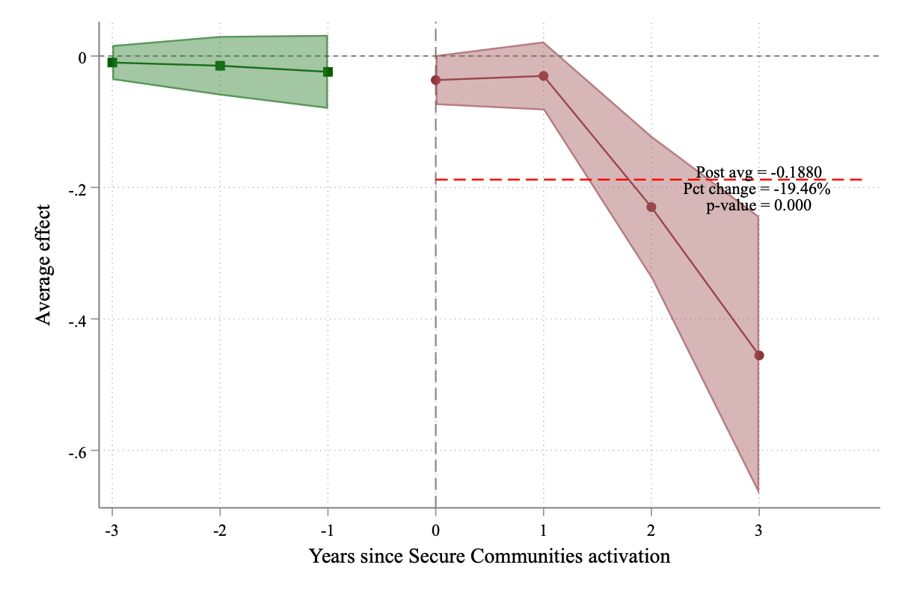
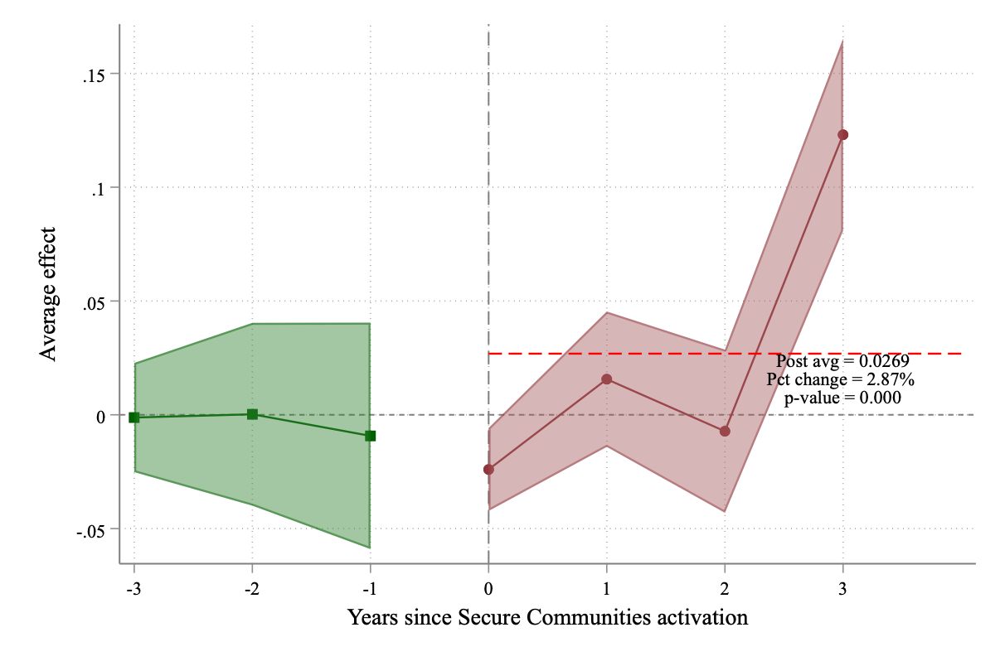
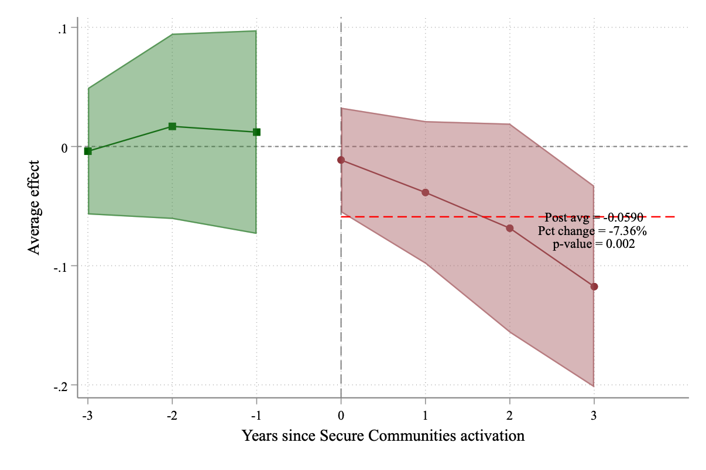
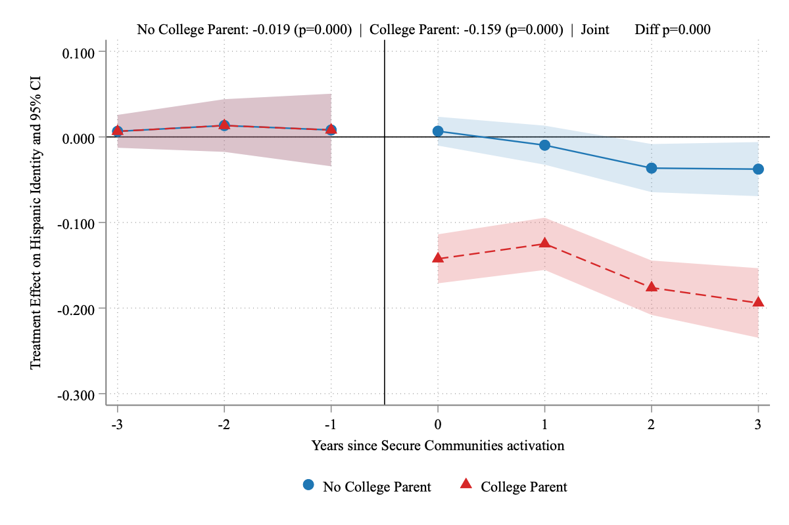
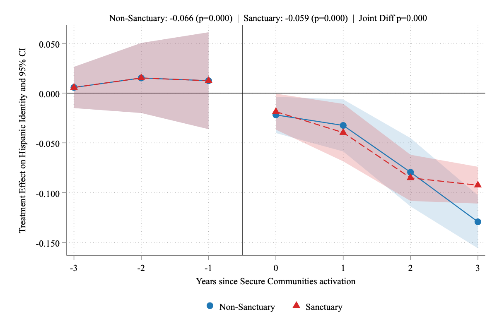

## Important links

- [Paper](immigration_enforcement_hispanic.pdf)

## Abstract

Ethnic identity is typically treated as an immutable demographic attribute in most economic analysis. Motivated by recent work on ethnic attrition, we estimate the causal effect of immigration enforcement on the self-identification of Hispanic children. Exploiting the staggered rollout of the Secure Communities and imputation difference-in-differences method, we find that enforcement reduces self-reported Hispanic identity. This average effect masks a remarkable divergence by generation. While first- and third-generation immigrants retreat from Hispanic identity, second-generation citizens increase identification. We also find larger reductions among college-educated families and no differential effects by sanctuary city. Our results suggest that ethnic identity is not immune to policy, suggesting that policy evaluations must account for ethnic self-identity to avoid conflating policy effects with compositional changes in the target population.

## Key Figures

The samples in the figures below include first-, second-, and third-generation Hispanic children that are racially White, ages 17 and below who live in intact families. First-generation Hispanic immigrants are children that were born in a Spanish-speaking country. Native-born second-generation Hispanic immigrants are children with at least one parent born in a Spanish-speaking country. Native-born third-generation Hispanic immigrants are children with native-born parents and at least one grandparent born in a Spanish-speaking country. 

{loading="lazy" width="1206" height="804"}

{loading="lazy" width="1206" height="804"}

{loading="lazy" width="1206" height="804"}

{loading="lazy" width="1206" height="804"}

{loading="lazy" width="1200" height="800"}

{loading="lazy" width="1200" height="800"}

## Citation

Hadah, Hussain and Denteh, Augustine. *Immigration Enforcement and Hispanic Identity* (December 2025). Working paper. https://www.hussainhadah.com/research/working-papers/hadah-denteh/immigration_enforcement_hispanic.pdf

```bibtex
@misc{HadahDenteh2025SC,
  title        = {Immigration Enforcement and Hispanic Identity},
  author       = {Hadah, Hussain and Denteh, Augustine},
  year         = {2025},
  month        = dec,
  note         = {Working paper}
}
```
