## Important links

- [Paper (pdf)](https://hhadah.github.io/sc-hispanic-adult-suicide/my_paper/sc_and_hispanic_children_suicide.pdf)
- [Slides (pdf)](https://hhadah.github.io/sc-hispanic-adult-suicide/presentations/01-oct-22-2025/hadah-oct-22-2025.pdf)
- [Slides (html)](https://hhadah.github.io/sc-hispanic-adult-suicide/presentations/01-oct-22-2025/hadah-oct-22-2025.html)
- [APPAM Slides (pdf)](https://hhadah.github.io/sc-hispanic-adult-suicide/presentations/02-appam/hadah-nov-15-2025.pdf)
- [APPAM Slides (html)](https://hhadah.github.io/sc-hispanic-adult-suicide/presentations/02-appam/hadah-nov-15-2025.html)
- 
## Abstract

I estimate the causal impact of the US Secure Communities (SC) program---which greatly expanded deportation risk nationwide---on suicide rates among Hispanic populations. Exploiting SC's staggered county-level rollout between 2008 and 2013, I use the triple difference-in-differences (DDD) estimator proposed by Borusyak, Jaravel, and Spiess (2024) to identify causal effects. The DDD comparison of Hispanic versus non-Hispanic White populations reveals complex and heterogeneous effects. For adults aged 34+, SC produces a significant overall increase of 0.11 per 100,000. The results are driven by men, who experience substantial increases of 1.21 while women show significant decreases. The gender divergence is particularly pronounced among adults aged 45+, where men show large increases 2.27 representing a 23.5\% increase from baseline, while women exhibit sustained decreases. Local contexts significantly moderate these effects: stronger economic conditions provide greater protection, while Democratic-leaning counties experience larger adult suicide rate increases. I find that the mechanisms---and the stark gender gaps---are supported by significant increases in deaths of despair among Hispanic men following SC implementation. Sanctuary policies appear to have neither a mitigating nor a worsening effect on Hispanic suicides. Because Hispanic ethnicity is often underreported in mortality data, these estimates likely understate the true effects, especially for adult men who bear the greatest harm. Overall, immigration enforcement produces complex mental health impacts fundamentally shaped by gender, age, and local economic environments.

## Important Figures

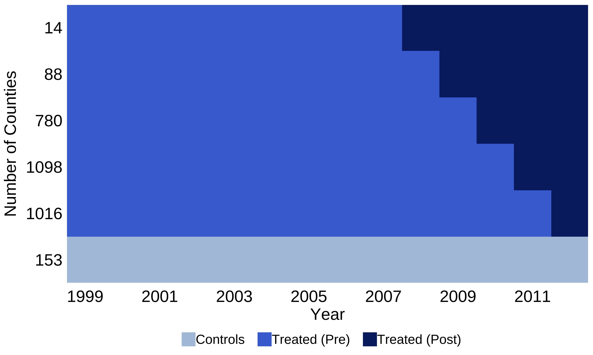{loading="lazy" width="3000" height="1800"}

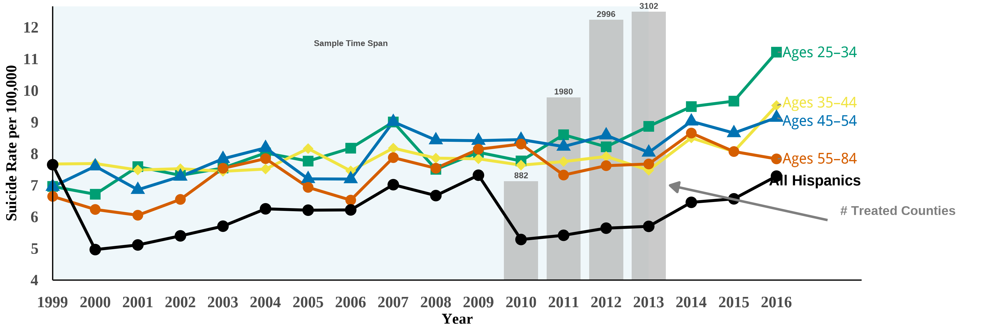{loading="lazy" width="3600" height="1200"}

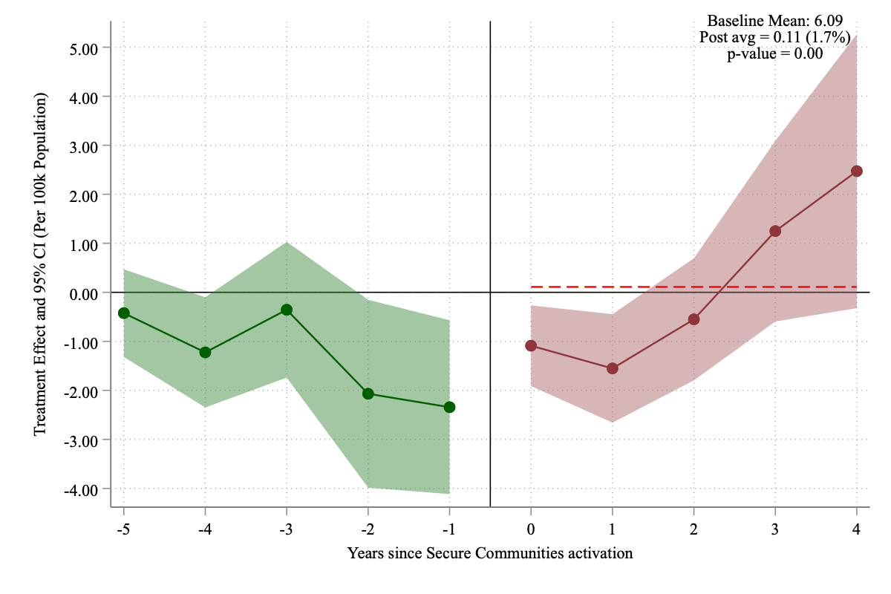{loading="lazy" width="1200" height="800"}

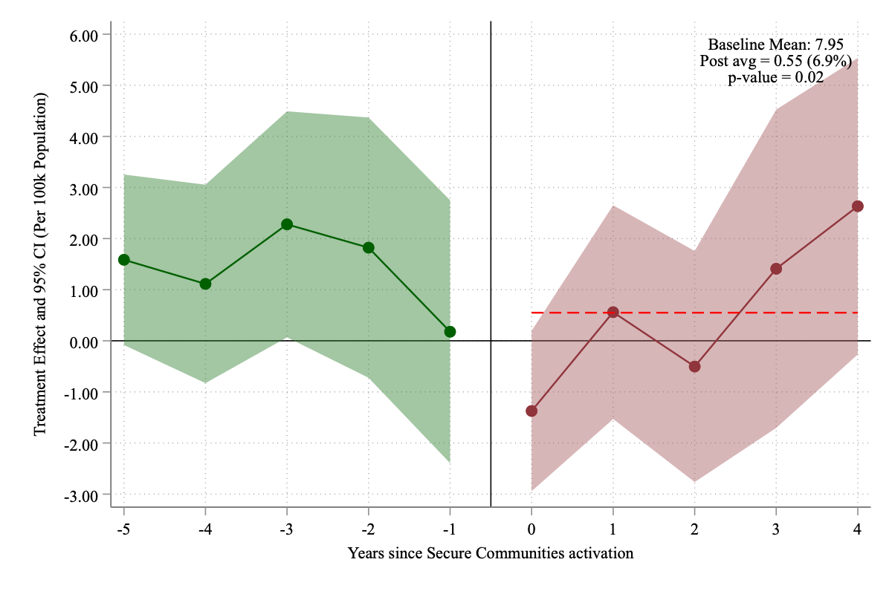{loading="lazy" width="1200" height="800"}

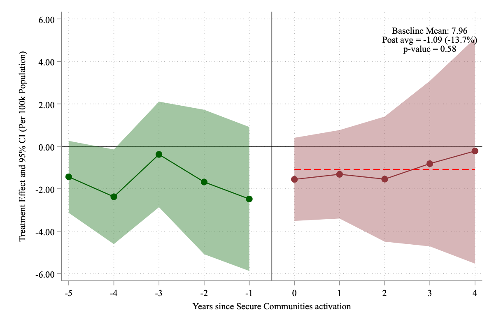{loading="lazy" width="1200" height="800"}

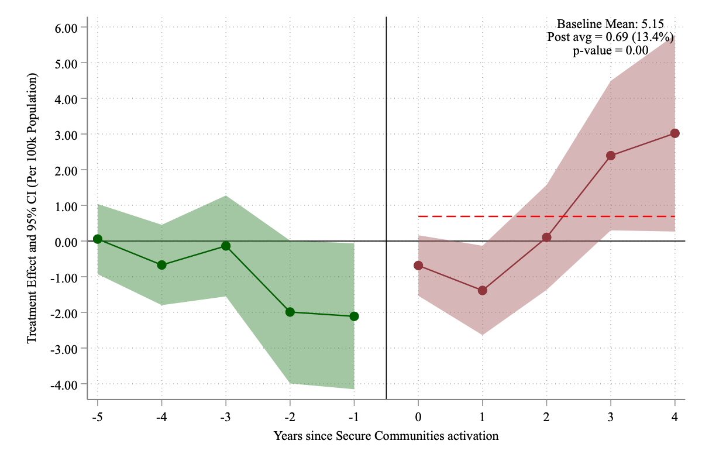{loading="lazy" width="1200" height="800"}

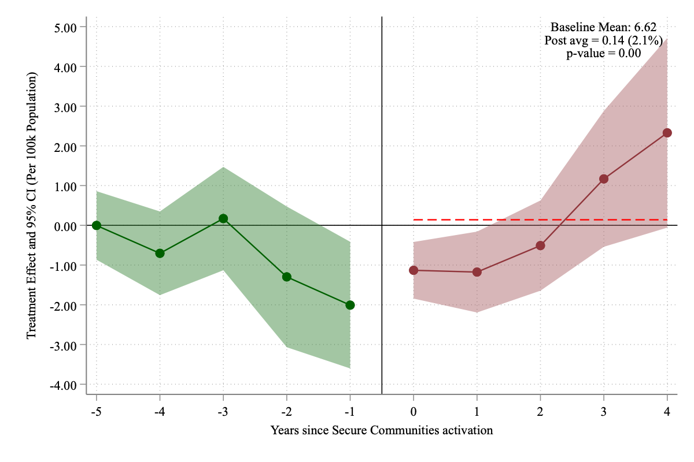{loading="lazy" width="1200" height="800"}

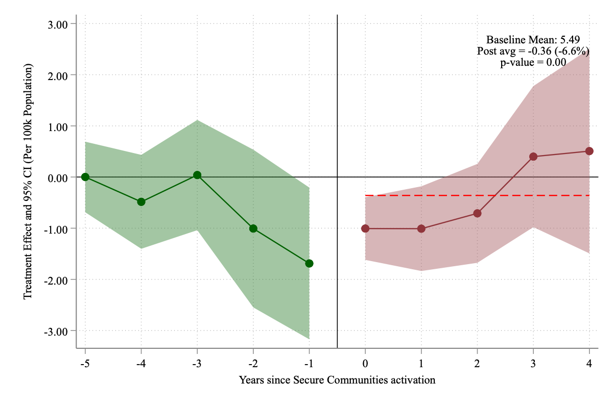{loading="lazy" width="1200" height="800"}

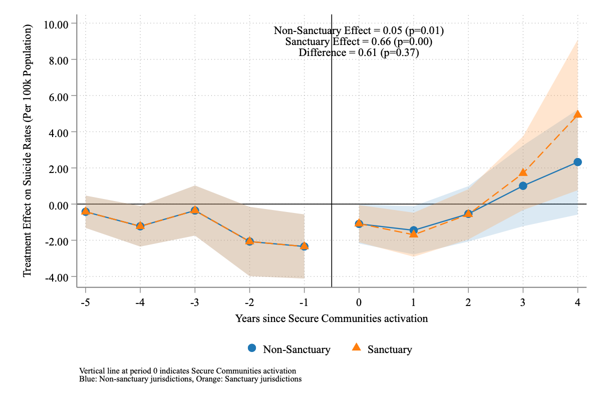{loading="lazy" width="1200" height="800"}

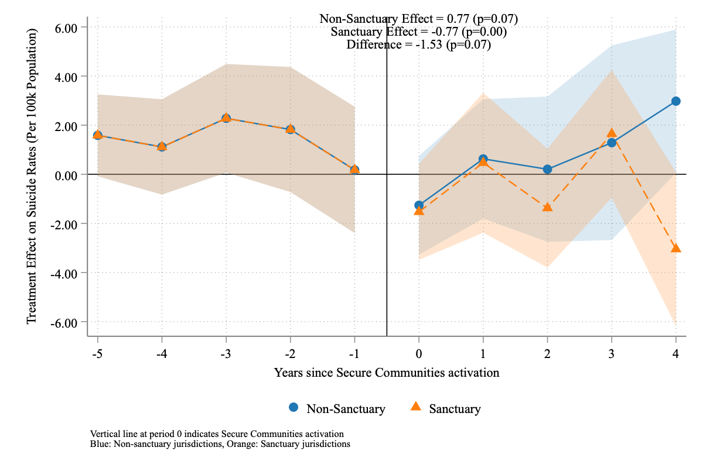{loading="lazy" width="1200" height="800"}

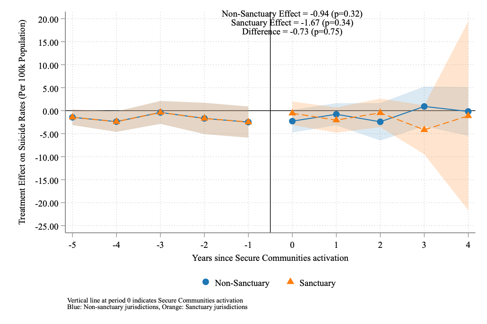{loading="lazy" width="1200" height="800"}

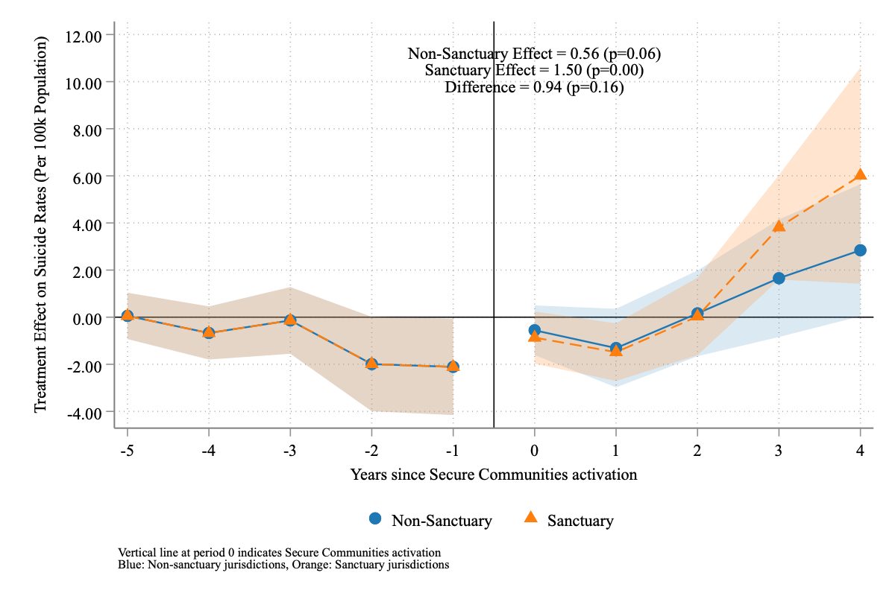{loading="lazy" width="1200" height="800"}

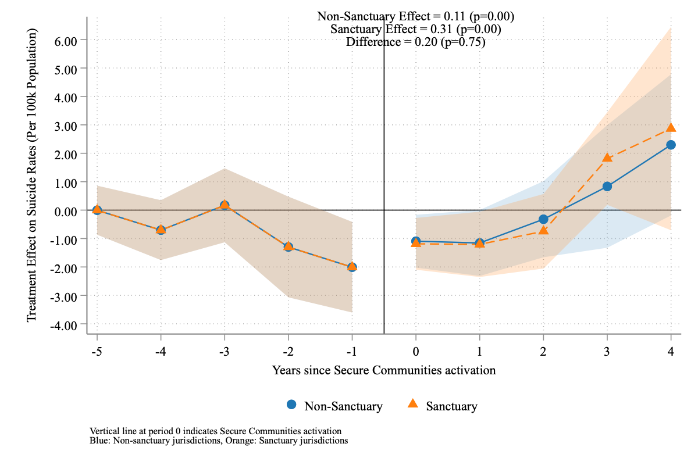{loading="lazy" width="1200" height="800"}
