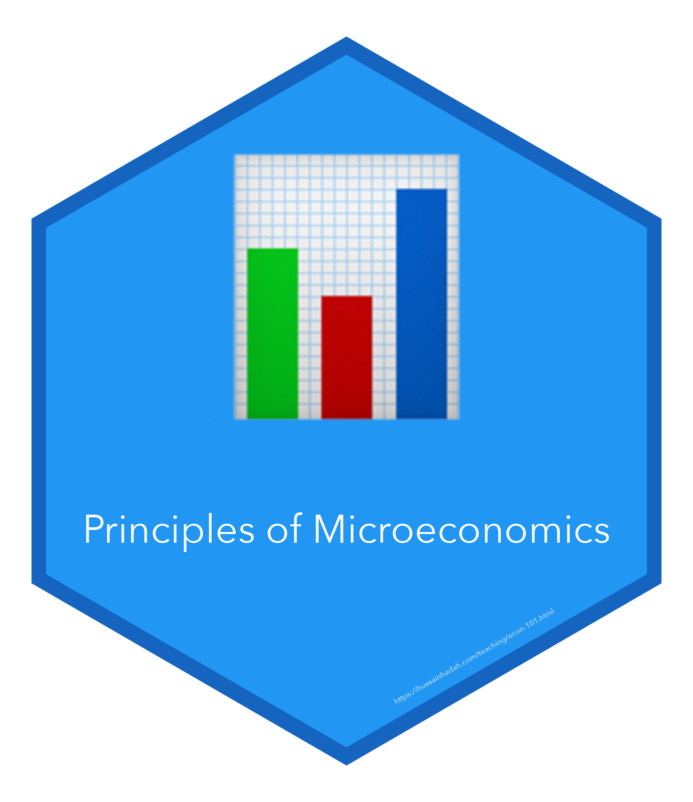

## {width="21" height="24" style="vertical-align: middle; margin-right: 10px;"} Course overview

**Course Information**
- **Institution**: University of Houston
- **Semesters**: Summer 2021, Spring 2022, and Summer 2022
- **Course Code**: ECON 2304

This course is an introduction to microeconomics: individual consumer and firm behavior, supply and demand, and the market determination of prices, production and income. We will analyze government policies of price controls, taxation, monopoly and antitrust laws, market failures and environmental policy.

::: {.callout-important icon=false}
### Course resources
[Download the syllabus](https://hhadah.github.io/MicroSlides/Syllabus/ECON2304_Summer2022_Syllabus.pdf).
:::

---

## Slides

1. Introduction \[[**.html**](https://hhadah.github.io/MicroSlides/MyPresentations/intro/intro.html) | [**.pdf**](https://hhadah.github.io/MicroSlides/MyPresentations/intro/intro.pdf)\]

2. The Ten Principles of Economics \[[**.html**](https://hhadah.github.io/MicroSlides/MyPresentations/Ch1/Ch1.html) | [**.pdf**](https://hhadah.github.io/MicroSlides/MyPresentations/Ch1/Ch1.pdf)\]

3. Thinking Like an Economist \[[**.html**](https://hhadah.github.io/MicroSlides/MyPresentations/Ch2/Ch2.html) | [**.pdf**](https://hhadah.github.io/MicroSlides/MyPresentations/Ch2/Ch2.pdf)\]

4. Interdependence and the Gains from Trade
 \[[**.html**](https://hhadah.github.io/MicroSlides/MyPresentations/Ch3/Ch3.html) | [**.pdf**](https://hhadah.github.io/MicroSlides/MyPresentations/Ch3/Ch3.pdf)\]

5. Market Forces of Supply & Demand
 \[[**.html**](https://hhadah.github.io/MicroSlides/MyPresentations/Ch4/Ch4.html) | [**.pdf**](https://hhadah.github.io/MicroSlides/MyPresentations/Ch4/Ch4.pdf)\]
 
6. Elasticity and Its Application \[[**.html**](https://hhadah.github.io/MicroSlides/MyPresentations/Ch5/Ch5.html) | [**.pdf**](https://hhadah.github.io/MicroSlides/MyPresentations/Ch5/Ch5.pdf)\]

7. Supply, Demand and Government Policies \[[**.html**](https://hhadah.github.io/MicroSlides/MyPresentations/Ch6/Ch6.html) | [**.pdf**](https://hhadah.github.io/MicroSlides/MyPresentations/Ch6/Ch6.pdf)\]

8. Consumers, Producers, and the Efficiency of Markets \[[**.html**](https://hhadah.github.io/MicroSlides/MyPresentations/Ch7/Ch7.html) | [**.pdf**](https://hhadah.github.io/MicroSlides/MyPresentations/Ch7/Ch7.pdf)\]

9. The Costs of Taxation \[[**.html**](https://hhadah.github.io/MicroSlides/MyPresentations/Ch8/Ch8.html) | [**.pdf**](https://hhadah.github.io/MicroSlides/MyPresentations/Ch8/Ch8.pdf)\]

10. International Trade \[[**.html**](https://hhadah.github.io/MicroSlides/MyPresentations/Ch9/Ch9.html) | [**.pdf**](https://hhadah.github.io/MicroSlides/MyPresentations/Ch9/Ch9.pdf)\]

11. Externalities \[[**.html**](https://hhadah.github.io/MicroSlides/MyPresentations/Ch10/Ch10.html) | [**.pdf**](https://hhadah.github.io/MicroSlides/MyPresentations/Ch10/Ch10.pdf)\]

12. Public Goods and Common Resources \[[**.html**](https://hhadah.github.io/MicroSlides/MyPresentations/Ch11/Ch11.html) | [**.pdf**](https://hhadah.github.io/MicroSlides/MyPresentations/Ch11/Ch11.pdf)\]

13. The Costs of Production \[[**.html**](https://hhadah.github.io/MicroSlides/MyPresentations/Ch13/Ch13.html) | [**.pdf**](https://hhadah.github.io/MicroSlides/MyPresentations/Ch13/Ch13.pdf)\]

14. Monopoly \[[**.html**](https://hhadah.github.io/MicroSlides/MyPresentations/Ch15/Ch15.html) | [**.pdf**](https://hhadah.github.io/MicroSlides/MyPresentations/Ch15/Ch15.pdf)\]

15. Monopolistic Competition \[[**.html**](https://hhadah.github.io/MicroSlides/MyPresentations/Ch16/Ch16.html) | [**.pdf**](https://hhadah.github.io/MicroSlides/MyPresentations/Ch16/Ch16.pdf)\]
