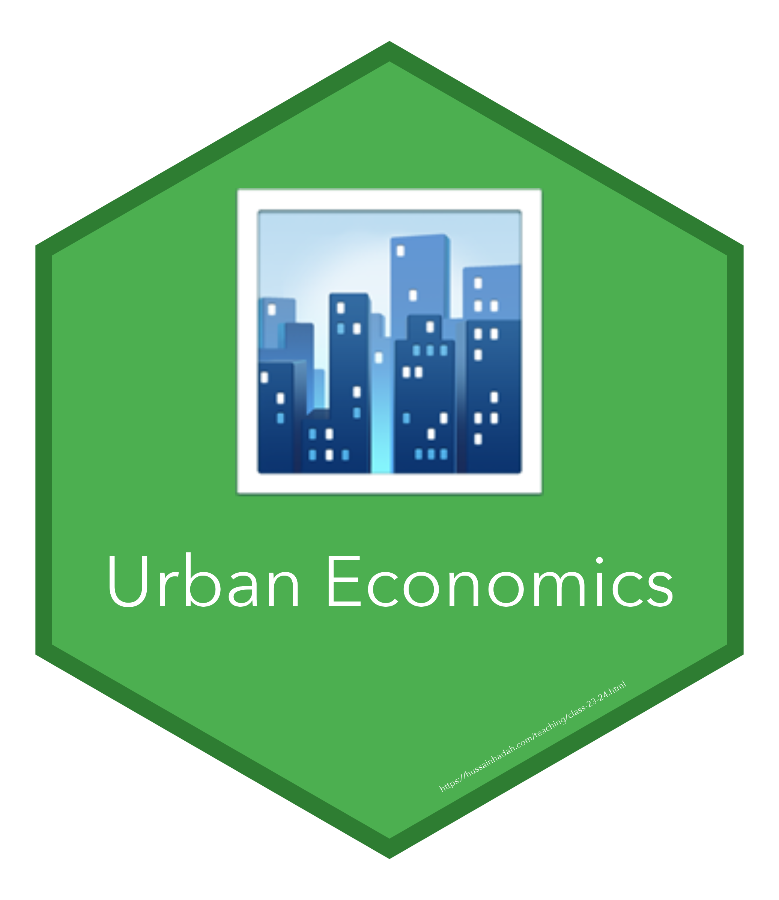

## Teaching statement

[Read my teaching statement](/cv/Hadah_Teaching.pdf).

---

## Spring 2024

::: {.grid}
::: {.g-col-12 .g-col-md-2 .d-flex .align-items-center .justify-content-center}
{.img-fluid width="150" height="173"}
:::

::: {.g-col-12 .g-col-md-10}
### [Urban Economics](class-23-24.qmd)

**Tulane University | Spring 2024**

A review of the determinants of the location, size, growth, and form of urban areas. Study of the major issues of contemporary urban life: physical deterioration, growth of ghettos, congestion, pollution, transportation, and land use.

[**📄 View Syllabus**](https://hhadah.github.io/urban-econ/syllabus/UrbanEcon3320SyllabusSpring2024HHadah.pdf) | [**🎯 View Course Materials**](class-23-24.qmd)
:::
:::

---

## 2021 to 2022

::: {.grid}
::: {.g-col-12 .g-col-md-2 .d-flex .align-items-center .justify-content-center}
{.img-fluid width="150" height="173"}
:::

::: {.g-col-12 .g-col-md-10}
### [Principles of Microeconomics](econ-101.qmd)

**University of Houston | Summer 2021, Spring 2022, and Summer 2022**

This course is an introduction to microeconomics: individual consumer and firm behavior, supply and demand, and the market determination of prices, production and income. We analyze government policies of price controls, taxation, monopoly and antitrust laws, market failures and environmental policy.

[**📄 View Syllabus**](https://hhadah.github.io/MicroSlides/Syllabus/ECON2304_Summer2022_Syllabus.pdf) | [**🎯 View Course Materials**](econ-101.qmd)
:::
:::

---

::: {.callout-note icon=false}
## Course philosophy

My teaching emphasizes:

- **Active learning.** Interactive exercises and applications to current economic questions
- **Data literacy.** Practice reading empirical research and interpreting statistical evidence
- **Policy relevance.** Connections between economic theory and policy choices
- **Inclusive participation.** Course structures that give every student a way to engage
:::
